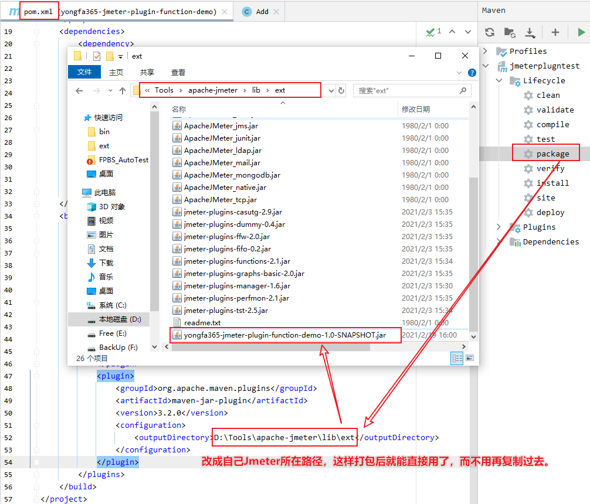
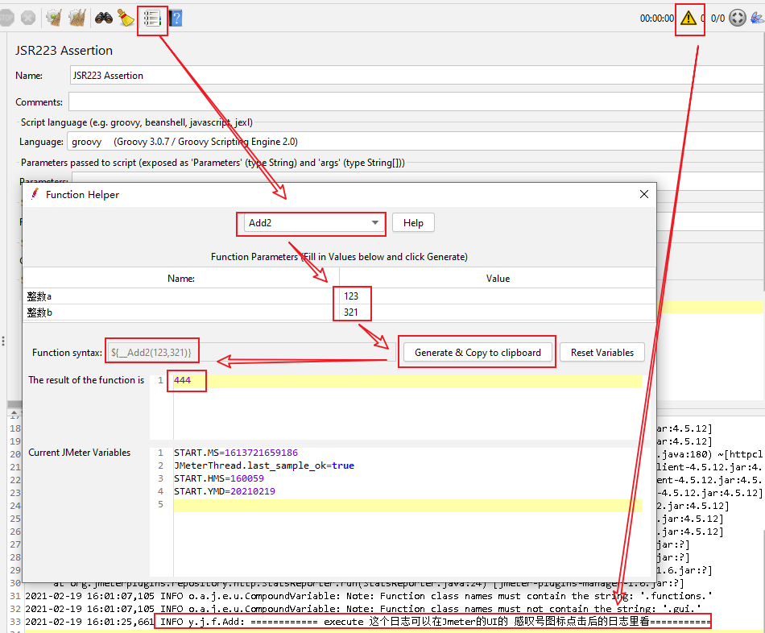

### 简介
写JMeter函数插件的最少必要代码
- jdk8
- class类的全名称必须满足：*.functions.*，也就是包名必须有functions
- 编译成jar包，放到Jmeter所在目录，如：D:\Tools\apache-jmeter\lib\ext

### 打包方法

### 演示

### 代码
[Add.java](src\main\java\yongfa365\jmeter\functions\Add.java)